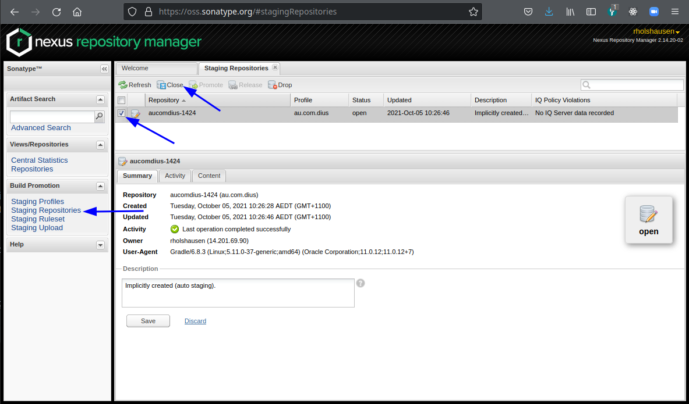
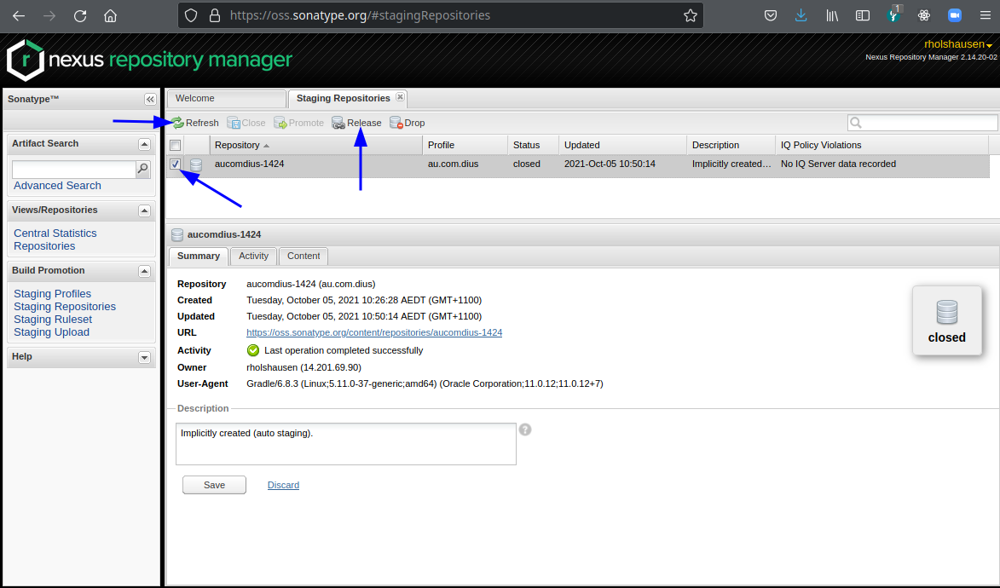

# Releasing Pact-JVM

The Pact-JVM project releases three types of artifacts: Java JAR files to Maven Central, a Gradle plugin to plugins.gradle.org
and Pact files to pact-foundation.pact.dius.com.au.

## 1. Required Credentials and Software

### Getting access to release to Maven Central

The Maven Central repository is provided by Sonatype. You need to signup to their Jira at 
https://issues.sonatype.org/secure/Signup!default.jspa and then get a Pact-JVM administrator to raise a ticket
to get your user permission to publish to the `au.com.dius` project.

### Access to Gradle plugin portal

You need to get an API key to publish the Pact-JVM Gradle plugin from the current owner of the plugin on the plugin 
portal. The plugin is listed at https://plugins.gradle.org/plugin/au.com.dius.pact.

### Getting access to the pact-foundation.pact.dius.com.au broker (can skip this step)

You can request access to the broker by emailing support@pactflow.io. This step can also be skipped.

### Create a PGP key

Maven Central has a requirement that all artifacts are signed. You need to create a GPG key for this. See 
https://www.gnupg.org/gph/en/manual/c14.html for more information.

### Install the JDK required for the version being released

The JAR files must be built with minimum required JDK version. You may need to set the JAVA_HOME environment variable 
to point to this version of the JDK. The minimum JDK versions are listed at [Supported JDK and specification versions](https://github.com/pact-foundation/pact-jvm#supported-jdk-and-specification-versions).
[SdkMan](https://sdkman.io/) is a very good tool for managing different JDK versions.

## 2. Setting up your local Gradle

All the credentials from step 1 need to go into your local gradle property file. For UNIX based systems, this will
be in `~/.gradle/gradle.properties`.

```
sonatypeUsername              # this is the username you signed up with at the Sonatype Jira
sonatypePassword              # this is your sonatype Jira password
gradle.publish.key            # this is the Gradle plugin portal API key
gradle.publish.secret         # this is the Gradle plugin portal API key secret
signing.keyId                 # this is your GPG key ID (run `gpg -K` to see this)
signing.password              # GPG key password
signing.secretKeyRingFile     # Path to the GPG secret key file (should be ~/.gnupg/secring.gpg)
pactBrokerToken               # This is the API token to pact-foundation.pact.dius.com.au broker
```

## 3. Running the release script

You can run the release script `releasePrep.groovy` in the root of the project. It will prompt you for all
the steps to run. For most of the time you can just hit `ENTER` for the default values.  Use `Control-C` any time to abort.

If any step fails, you can re-run the script once you have fixed the issue and select `n` for all the steps already run to skip them.
Most of the steps should only ever be run once for a particular version.

The script will check the version of the JDK, and allow you to abort if it is not correct.

```console
$ ./releasePrep.groovy 
==>: git pull
Already up to date.
==>: ./gradlew --version 2>/dev/null | awk '/^JVM:/ { print $2 }'
Execute Build?: [Y] 
```

This asks if you want to run a full build as part of the release process. You can skip it if you are confident that the
build is ok.

```console
Execute Build?: [Y] n
==>: git log --pretty='* %h - %s (%an, %ad)' 4_2_13..HEAD
* d86e79d16 - fix: broken spec after merging #1455 (Ronald Holshausen, Tue Oct 5 10:08:10 2021 +1100)
* 673689a6c - chore: correctly sort the interactions before writing (Ronald Holshausen, Tue Oct 5 08:57:31 2021 +1100)
* 6da800794 - Merge pull request #1460 from psliwa/feature-support-for-TestTarget-annotation-for-junit-and-scala (Ronald Holshausen, Tue Oct 5 09:04:40 2021 +1100)
* 25be84f20 - feat: add support for @TestTarget annotation for junit tests written in scala (piotr.sliwa, Mon Oct 4 22:34:04 2021 +0200)
* d014fb03b - Merge pull request #1455 from pact-foundation/TimothyJones-patch-1 (Ronald Holshausen, Thu Sep 30 11:50:40 2021 +1000)
* ac6741897 - chore: Revert accidental change to interface (Timothy Jones, Thu Sep 30 11:34:34 2021 +1000)
* 861001505 - test(PactBrokerClient): Update test for when include pending pacts is set to false (Timothy Jones, Thu Sep 30 11:30:40 2021 +1000)
* 349231d8f - fix(PactBrokerClient): Send `includePendingStatus=false` when enablePending is set to false (Timothy Jones, Thu Sep 30 10:47:32 2021 +1000)
* a36a51fda - Merge branch 'v4.1.x' (Ronald Holshausen, Wed Sep 29 09:13:56 2021 +1000)
* 96521e3a2 - fix: codenarc violation #1449 (Ronald Holshausen, Wed Sep 29 09:13:23 2021 +1000)
* 20a5d590b - Merge branch 'v4.1.x' (Ronald Holshausen, Wed Sep 29 09:03:23 2021 +1000)
* bcc1d12c0 - fix: correct the pact source description when using the URL option #1449 (Ronald Holshausen, Wed Sep 29 09:01:21 2021 +1000)
* daac53382 - bump version to 4.2.14 (Ronald Holshausen, Mon Sep 27 17:07:12 2021 +1000)
* 5706c6034 - bump version to 4.1.29 (Ronald Holshausen, Mon Sep 27 16:36:14 2021 +1000)
* 085c12735 - update changelog for release 4.1.28 (Ronald Holshausen, Mon Sep 27 16:21:44 2021 +1000)
Describe this release: [Bugfix Release]
```

Next step is to check the changelog and enter a description of the release. The description will be the heading in the
changelog.

```console
Describe this release: [Bugfix Release]enablePending + scala support            
What is the version for this release?: [4.2.14]
```

Just hit enter to accept the version. You shouldn't have to change this.

```console
Describe this release: [Bugfix Release]enablePending + scala support            
What is the version for this release?: [4.2.14]
Update Changelog?: [Y]
```

Hit enter to update the changelog with the details. If you are re-running the release, enter `n` here.

```console
==>: git add CHANGELOG.md
==>: git diff --cached
diff --git a/CHANGELOG.md b/CHANGELOG.md
index 95e053366..1b896851b 100644
--- a/CHANGELOG.md
+++ b/CHANGELOG.md
@@ -1,5 +1,23 @@
 To generate the log, run `git log --pretty='* %h - %s (%an, %ad)'  TAGNAME..HEAD` replacing TAGNAME and HEAD as appropriate.
 
+# 4.2.14 - enablePending + scala support
+
+* d86e79d16 - fix: broken spec after merging #1455 (Ronald Holshausen, Tue Oct 5 10:08:10 2021 +1100)
+* 673689a6c - chore: correctly sort the interactions before writing (Ronald Holshausen, Tue Oct 5 08:57:31 2021 +1100)
+* 6da800794 - Merge pull request #1460 from psliwa/feature-support-for-TestTarget-annotation-for-junit-and-scala (Ronald Holshausen, Tue Oct 5 09:04:40 2021 +1100)
+* 25be84f20 - feat: add support for @TestTarget annotation for junit tests written in scala (piotr.sliwa, Mon Oct 4 22:34:04 2021 +0200)
+* d014fb03b - Merge pull request #1455 from pact-foundation/TimothyJones-patch-1 (Ronald Holshausen, Thu Sep 30 11:50:40 2021 +1000)
+* ac6741897 - chore: Revert accidental change to interface (Timothy Jones, Thu Sep 30 11:34:34 2021 +1000)
+* 861001505 - test(PactBrokerClient): Update test for when include pending pacts is set to false (Timothy Jones, Thu Sep 30 11:30:40 2021 +1000)
+* 349231d8f - fix(PactBrokerClient): Send `includePendingStatus=false` when enablePending is set to false (Timothy Jones, Thu Sep 30 10:47:32 2021 +1000)
+* a36a51fda - Merge branch 'v4.1.x' (Ronald Holshausen, Wed Sep 29 09:13:56 2021 +1000)
+* 96521e3a2 - fix: codenarc violation #1449 (Ronald Holshausen, Wed Sep 29 09:13:23 2021 +1000)
+* 20a5d590b - Merge branch 'v4.1.x' (Ronald Holshausen, Wed Sep 29 09:03:23 2021 +1000)
+* bcc1d12c0 - fix: correct the pact source description when using the URL option #1449 (Ronald Holshausen, Wed Sep 29 09:01:21 2021 +1000)
+* daac53382 - bump version to 4.2.14 (Ronald Holshausen, Mon Sep 27 17:07:12 2021 +1000)
+* 5706c6034 - bump version to 4.1.29 (Ronald Holshausen, Mon Sep 27 16:36:14 2021 +1000)
+* 085c12735 - update changelog for release 4.1.28 (Ronald Holshausen, Mon Sep 27 16:21:44 2021 +1000)
+
 # 4.2.13 - Bugfix + add ignore parameter to Maven can-i-deploy task
 
 * 70ebaa38f - fix: org.apache.httpcomponents:httpmime needs to be defined as api for consumer lib #1446 (Ronald Holshausen, Mon Sep 27 16:04:51 2021 +1000)
==>: git commit -m 'update changelog for release 4.2.14'
[master 528891df4] update changelog for release 4.2.14
 1 file changed, 18 insertions(+)
==>: git status
On branch master
Your branch is ahead of 'origin/master' by 1 commit.
  (use "git push" to publish your local commits)

Tag and Push commits?: [Y]
```

Hit `ENTER` to tag and push the commit. It will tag the repo with the version from the previous step. (Enter `n` if you
are re-running the release script)

```console
Tag and Push commits?: [Y] 
==>: git push
Enumerating objects: 5, done.
Counting objects: 100% (5/5), done.
Delta compression using up to 12 threads
Compressing objects: 100% (3/3), done.
Writing objects: 100% (3/3), 1.09 KiB | 186.00 KiB/s, done.
Total 3 (delta 2), reused 0 (delta 0), pack-reused 0
remote: Resolving deltas: 100% (2/2), completed with 2 local objects.
To github.com:pact-foundation/pact-jvm.git
   d86e79d16..528891df4  master -> master
==>: git tag 4_2_14
==>: git push --tags
Total 0 (delta 0), reused 0 (delta 0), pack-reused 0
To github.com:pact-foundation/pact-jvm.git
 * [new tag]             4_2_14 -> 4_2_14
Publish artifacts to maven central?: [Y]
```

Next step is to build the artifacts and publish them to Maven Central and then upload the Gradle plugin to the Gradle
plugin portal. This will take a little while (15 minutes for me), depending on your machine specs and internet speed.

```console
Publish pacts to pact-foundation.pact.dius.com.au?: [Y] 
```

You can skip this if you don't have a Pactflow API token setup.

```console
Bump version to 4.2.15?: [Y] 
```

Hit `ENTER` here. The last step is to bump the minor version and commit that, so all future dev is against the next version.

```console
Bump version to 4.2.15?: [Y] 
==>: sed -i -e "s/version = '4.2.14'/version = '4.2.15'/" build.gradle
==>: git add build.gradle
==>: git diff --cached
diff --git a/build.gradle b/build.gradle
index c02741ace..249b2a555 100644
--- a/build.gradle
+++ b/build.gradle
@@ -36,7 +36,7 @@ subprojects {
     return
   }
 
-  version = '4.2.14'
+  version = '4.2.15'
   
   buildscript {
     repositories {
Commit and push this change?: [Y] 
==>: git commit -m 'bump version to 4.2.15'
[master a5ab732e6] bump version to 4.2.15
 1 file changed, 1 insertion(+), 1 deletion(-)
==>: git push
Enumerating objects: 5, done.
Counting objects: 100% (5/5), done.
Delta compression using up to 12 threads
Compressing objects: 100% (3/3), done.
Writing objects: 100% (3/3), 307 bytes | 307.00 KiB/s, done.
Total 3 (delta 2), reused 0 (delta 0), pack-reused 0
remote: Resolving deltas: 100% (2/2), completed with 2 local objects.
To github.com:pact-foundation/pact-jvm.git
   528891df4..a5ab732e6  master -> master
```

All done.

## 4. Release the artifacts uploaded to Sonatype to Maven Central

Log onto [oss.sonatype.org](https://oss.sonatype.org) and select `Staging Repositories` from the menu on the left hand side. 
You should see a new staging repository for `au.com.dius` listed. Select the repository and select the Close button. 
This will close the repository and run all the Maven Central rules.



Once the repository is successfully closed (it takes a few minutes, select the refresh button to re-load ands wait for the
status to change to `closed`), select the repository again and then select the Release button.



## 5. Create a Github release

Create a Github release from the tag created by the release script. The contents should be populated with the
values from the CHANGELOG.md that the release script created.
